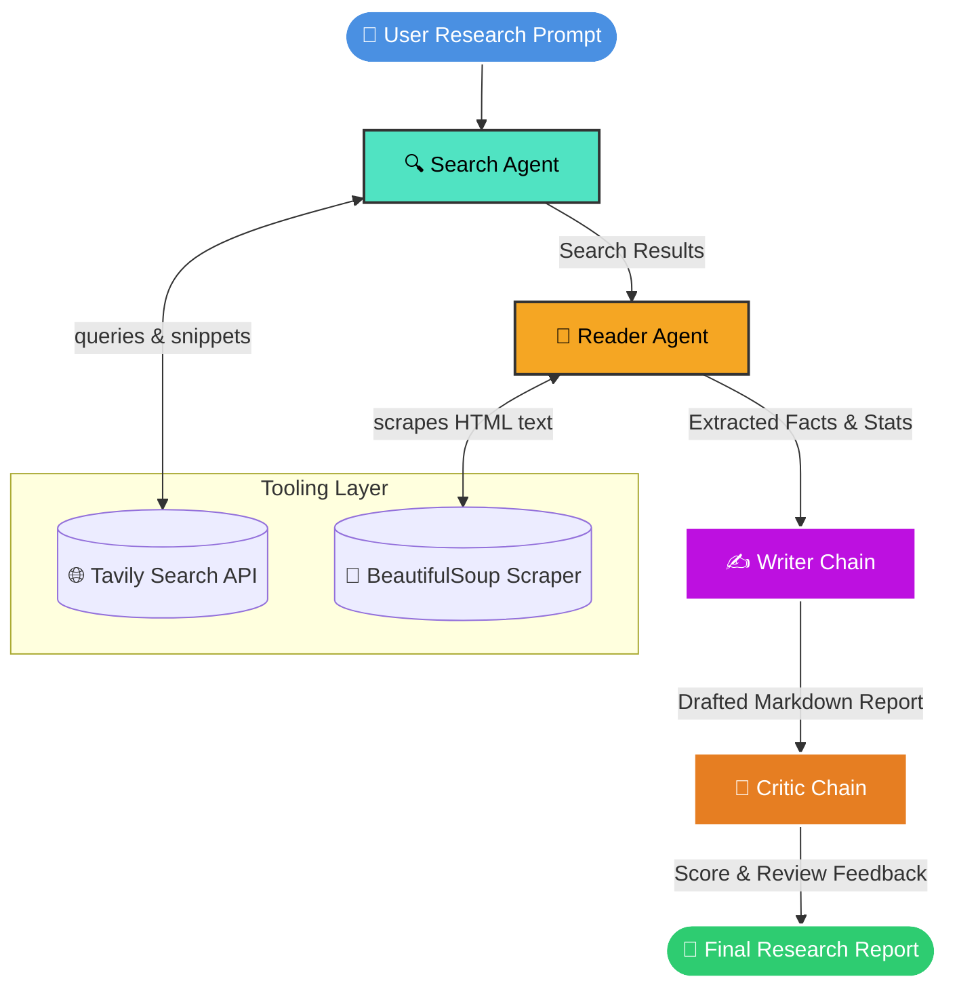

<div align="center">

# 🤖 Multi-Agent Research Assistant

### *An autonomous AI companion built by a student to automate deep web research, web scraping, and report writing!*

[](https://www.python.org/)
[](https://www.langchain.com/)
[](https://langchain-ai.github.io/langgraph/)
[](https://groq.com/)
[](LICENSE)

<br />

[⚡ Demo](#-demo) • [💡 Why I Built This](#-why-i-built-this) • [✨ Features](#-key-features) • [🏗️ Architecture](#️-architecture) • [🚀 Quickstart](#-installation--setup) • [📖 How Agents Work](#-how-the-agents-work)

</div>

---

> [!NOTE]
> **Hi there! 👋 I'm Raazi**, an AI and Computer Science student. I built this **Multi-Agent Research Assistant** to solve a problem I faced every day: spending hours opening 50+ browser tabs, reading long articles, and compiling notes for research projects. 
> 
> This tool deploys a team of smart AI agents that search the web, scrape trustworthy sources, extract key stats, write structured research reports, and even review their own work!

---

## ⚡ Demo

*(Visual previews of the project in action)*

| **Terminal Pipeline Log** | **Generated Report Preview** |
| :---: | :---: |
|  |  |
| *Watch agents hand off tasks in real-time* | *Final structured markdown report output* |

---

## 💡 Why I Built This

### The Student Problem 😫
Whenever I started researching a new technology or paper, I noticed:
1. **Tab Overload**: My browser would crash with 30+ tabs open.
2. **Superficial Chatbot Answers**: Standard AI chatbots often gave me short summaries or hallucinated info because they didn't read actual webpage content.
3. **Time Wasted**: Manually copying stats, checking URLs, and formatting research papers took longer than the actual learning!

### My Multi-Agent Solution 💡
I decided to build a collaborative multi-agent system where every agent has a specific job:
- 🔍 **Searcher**: Finds relevant, reputable links using the Tavily Search API.
- 📖 **Reader**: Digs into the webpage using BeautifulSoup, filtering out ads and extracting actual facts.
- ✍️ **Writer**: Synthesizes everything into a clean, well-formatted markdown report.
- 🧐 **Critic**: Reviews the report, gives it a score out of 10, and points out any missing gaps!

---

## ✨ Key Features

- 🧠 **Team of 4 Specialized AI Agents**: Autonomous workflow combining LangChain agents and LCEL chains.
- ⚡ **Super Fast & Free LLM Inference**: Powered by **Groq (Llama 3.3 70B Versatile)** for blazing-fast responses.
- 🔍 **Real-Time Web Search**: Uses **Tavily AI Search API** to fetch up-to-date information.
- 📰 **Smart Web Scraping**: Parses clean article text using **BeautifulSoup4** while stripping clutter.
- 📊 **Structured Markdown Reports**: Generates clear reports with introductions, bulleted findings, conclusions, and hyperlinked sources.
- 🛡️ **Rate Limit & Error Safety**: Custom `safe_invoke` function handles API rate limits gracefully with automatic retries.
- 🧩 **Beginner-Friendly & Modular**: Simple Python structure that's easy to read, modify, and extend for learning!

---

## 🏗️ Architecture

Here is how the data flows through the project from user prompt to final report:

### 1. Workflow Diagram (Mermaid)



### 2. System Pipeline Overview (ASCII)

```
┌─────────────────────────────────────────────────────────────────────────────────┐
│                          STUDENT MULTI-AGENT PIPELINE                           │
└─────────────────────────────────────────────────────────────────────────────────┘
                                         │
                                         ▼
   ┌───────────────────────────────────────────────────────────────────────────┐
   │ 1. SEARCH AGENT (build_search_agent)                                      │
   │    • Takes your research topic                                            │
   │    • Uses web_search tool (Tavily AI) to get relevant domain links        │
   └───────────────────────────────────────────────────────────────────────────┘
                                         │
                                         ▼
   ┌───────────────────────────────────────────────────────────────────────────┐
   │ 2. READER AGENT (build_reader_agent)                                      │
   │    • Picks the single best source URL                                     │
   │    • Uses scrape_url tool (BeautifulSoup4) to extract real article text   │
   └───────────────────────────────────────────────────────────────────────────┘
                                         │
                                         ▼
   ┌───────────────────────────────────────────────────────────────────────────┐
   │ 3. WRITER CHAIN (writer_prompt | llm | StrOutputParser)                    │
   │    • Combines search snippets + scraped article text                      │
   │    • Writes a comprehensive report with intro, findings & sources         │
   └───────────────────────────────────────────────────────────────────────────┘
                                         │
                                         ▼
   ┌───────────────────────────────────────────────────────────────────────────┐
   │ 4. CRITIC CHAIN (critic_prompt | llm | StrOutputParser)                    │
   │    • Audits the drafted report for quality                                │
   │    • Gives a score out of 10, highlights strengths & missing details      │
   └───────────────────────────────────────────────────────────────────────────┘
```

---

## 🌟 Project Highlights

- ✅ **Built by a Student**: Created as a hands-on project to learn LangChain, LangGraph, and Agentic Workflows.
- ✅ **100% Open Source**: Free to use, modify, and experiment with.
- ✅ **Real Live Data**: No stale static data—fetches live web pages in real-time.
- ✅ **Self-Review Loop**: Includes a Critic agent that acts like an editor reviewing student work.

---

## 🛠️ Tech Stack

| Component | Technology | Why I Chose It |
| :--- | :--- | :--- |
| **Language** | [Python 3.11+](https://www.python.org/) | Simple syntax and great AI ecosystem |
| **Orchestration** | [LangChain](https://www.langchain.com/) / [LangGraph](https://langchain-ai.github.io/langgraph/) | Easy agent building and prompt chaining |
| **LLM Provider** | [Groq AI](https://groq.com/) | Blazing-fast Llama 3.3 70B inference for free |
| **Web Search** | [Tavily AI](https://tavily.com/) | Built specifically for AI agents to search cleanly |
| **Scraper** | [BeautifulSoup4](https://www.crummy.com/software/BeautifulSoup/) / [Requests](https://requests.readthedocs.io/) | Lightweight HTML parsing to extract main text |
| **Config** | [python-dotenv](https://github.com/theskumar/python-dotenv) | Keeps API keys safe in `.env` |

---

## 📁 Folder Structure

```filetree
Multi-Agent-Research-Assistant/
├── agents.py           # Defines Search Agent, Reader Agent, Writer Chain & Critic Chain
├── tools.py            # Custom Tavily Search and BeautifulSoup scraper tools
├── pipline.py          # Main interactive pipeline script with retry logic
├── generate_test.py    # Quick test script to verify LLM connection
├── requirements.txt    # Python packages list
├── .env.example        # Template for API keys
└── README.md           # Documentation
```

---

## 🚀 Installation & Setup

Want to try it out on your machine? Follow these easy steps:

### Prerequisites
- Python 3.11 or higher
- A free **Groq API Key** ([Get it here](https://console.groq.com/))
- A free **Tavily API Key** ([Get it here](https://tavily.com/))

### 1. Clone the Repo
```bash
git clone https://github.com/raazix/Multi-Agent-Research-Assistant.git
cd Multi-Agent-Research-Assistant
```

### 2. Create a Virtual Environment
```bash
# Mac/Linux
python3 -m venv .venv
source .venv/bin/activate

# Windows
python -m venv .venv
.venv\Scripts\activate
```

### 3. Install Requirements
```bash
pip install -r requirements.txt
```

### 4. Set Up Your `.env` File
Create a `.env` file in the root folder:
```bash
cp .env.example .env
```
Add your API keys inside `.env`:
```env
GROQ_API_KEY=gsk_your_groq_key_here
TAVILY_API_KEY=tvly-your_tavily_key_here
MODEL_NAME=llama-3.3-70b-versatile
```

### 5. Run the Project!
```bash
python pipline.py
```

---

## 💻 Sample Terminal Output

### Input Example
```text
Enter the research topic: How are autonomous AI agents impacting software development in 2026?
```

<details>
<summary>🔍 Click to expand terminal execution log</summary>

```text
==================================================
Step 1 - Search Agent is working
==================================================
Search results: Title: Autonomous AI Agents in Software Engineering
URL: https://example.org/ai-software-agents
Snippet: AI agents are shifting developer roles from manual coding to architecture design...

==================================================
Step 2 - Reader Agent is working
==================================================
Scraped result: Selected URL: https://example.org/ai-software-agents
Extracted Information:
- Developer productivity increased by 35% on routine tasks.
- Multi-agent coding assistants automate unit test generation and bug fixes.

==================================================
Step 3 - Writer is drafting the final report
==================================================
Final Report: ...

==================================================
Step 4 - Critic is reviewing the report
==================================================
Critic Feedback: Score: 9/10 | Strengths: Clear structure, strong statistics | Verdict: Solid analytical overview.
```
</details>

<details>
<summary>📜 Click to view generated Markdown report example</summary>

```markdown
# Impact of Autonomous AI Agents on Software Development

## Introduction
Autonomous AI agents are transforming modern software engineering. Rather than serving as simple code-completion tools, multi-agent frameworks are taking on multi-step engineering tasks like debugging, refactoring, and test writing.

## Key Findings

### 1. Productivity Boost on Routine Tasks
Studies show a 35% increase in developer throughput when routine tasks (boilerplate code, documentation, and unit tests) are delegated to AI agents.

### 2. Shift in Developer Roles
Software engineers are moving from writing syntax to acting as system architects and code reviewers.

## Conclusion
Adopting multi-agent assistants enables software teams to ship features faster while focusing on complex architectural challenges.

## Sources
- https://example.org/ai-software-agents
```

</details>

---

## 📖 How the Agents Work

| Agent / Chain | Purpose | Tools Used |
| :--- | :--- | :--- |
| **Search Agent** | Finds relevant articles and web snippets | `web_search` (Tavily AI) |
| **Reader Agent** | Scrapes clean text from the single best web link | `scrape_url` (BeautifulSoup4) |
| **Writer Chain** | Combines all facts and writes the markdown report | LCEL Prompt Chain |
| **Critic Chain** | Reviews the draft, points out gaps, and gives a score | LCEL Prompt Chain |

---

## 🛡️ Rate Limit & Retry Logic

Since API rate limits happen (especially on free tiers!), I built a small `safe_invoke` wrapper in `pipline.py` that automatically catches HTTP 429 errors, waits a few seconds, and retries cleanly without crashing:

```python
def safe_invoke(runnable, input_data, max_retries=3, initial_delay=5):
    attempt = 0
    delay = initial_delay
    while attempt < max_retries:
        try:
            return runnable.invoke(input_data)
        except Exception as e:
            if "429" in str(e) or "RESOURCE_EXHAUSTED" in str(e):
                attempt += 1
                time.sleep(delay)
                delay *= 1.5
            else:
                raise e
    return runnable.invoke(input_data)
```

---

## 📌 20 Sample Research Ideas to Try

Here are some cool topics you can test:

<details>
<summary>💡 Click to view 20 research topics</summary>

1. *What are the recent breakthroughs in solid-state batteries for electric cars?*
2. *How is quantum computing going to impact modern encryption by 2030?*
3. *What are the ethical debate points around autonomous AI agents?*
4. *How does vertical urban farming compare to traditional agriculture?*
5. *What are the key architectural features of Llama 3.3 compared to Llama 3.1?*
6. *How are microplastics affecting ocean marine life?*
7. *What are the current AI governance regulations in the EU?*
8. *How do zero-knowledge cryptography proofs work in simple terms?*
9. *What is the progress on commercial nuclear fusion energy?*
10. *How is remote work changing commercial real estate in major cities?*
11. *What are the top security best practices for Kubernetes clusters?*
12. *How do humanoid robots perform in modern automobile manufacturing?*
13. *What is GraphRAG and how is it different from standard RAG?*
14. *What are the latest clinical trials for cancer vaccines?*
15. *How does green hydrogen help decarbonize steel factories?*
16. *What are the economic challenges facing tech startups in high-interest rate environments?*
17. *How are desalination plants addressing freshwater shortages globally?*
18. *What are the most popular open-source LLM evaluation frameworks?*
19. *How does WebAssembly (Wasm) improve browser application speed?*
20. *What are the environmental impacts of deep-sea mining?*

</details>

---

## 🔮 Future Roadmap (What I Plan to Learn & Build Next)

- [ ] **Streamlit Web Interface**: Add a clean frontend so non-technical users can use it.
- [ ] **PDF Export**: Download final research reports as formatted PDFs.
- [ ] **Multi-Source Scraping**: Scrape 3-5 pages simultaneously instead of just 1.
- [ ] **LangGraph State Graph**: Upgrade to a full LangGraph `StateGraph` with state memory.
- [ ] **RAG / Vector Database**: Store research notes in ChromaDB for long-term project memory.

---

## 🤝 Contributing & Feedback

Since I'm still learning and improving this project, I'd **love** your feedback, ideas, or contributions!

1. Fork the repo
2. Create a branch (`git checkout -b feature/CoolIdea`)
3. Commit your changes (`git commit -m 'Add some cool feature'`)
4. Push to branch (`git push origin feature/CoolIdea`)
5. Open a Pull Request!

---

## ⭐ Support & Star

If you like this project or find it helpful for your own learning, **please consider leaving a ⭐ on GitHub!** It means a lot to a student developer!

---

## 📜 License

This project is licensed under the MIT License - feel free to use it for your own projects or learning!

---

## 👨‍💻 Author

**Raazi X**
- CS & AI Student Developer
- **GitHub**: [@raazix](https://github.com/raazix)
- **Repo**: [Multi-Agent-Research-Assistant](https://github.com/raazix/Multi-Agent-Research-Assistant)

<div align="center">
  <br />
  <sub>Built with ❤️ and late-night coffee by Raazi</sub>
</div>
