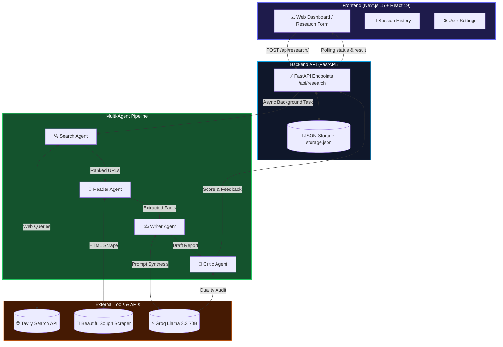

<div align="center">

# 🤖 Anveshan AI — Multi-Agent Research System

### *An autonomous full-stack AI research companion that automates deep web search, article scraping, multi-source synthesis, and report criticism!*

[](https://nextjs.org/)
[](https://react.dev/)
[](https://www.typescriptlang.org/)
[](https://fastapi.tiangolo.com/)
[](https://www.python.org/)
[](https://www.langchain.com/)
[](https://groq.com/)
[](LICENSE)

<br />

[⚡ Features](#-key-features) • [🏗️ Architecture](#️-system-architecture) • [📁 Directory Structure](#-directory-structure) • [🚀 Quickstart](#-quickstart--setup) • [🔌 API Reference](#-api-reference) • [👨‍💻 Author](#-author)

</div>

---

> [!NOTE]
> **Anveshan (अन्वेषण)** is a Sanskrit word meaning *"Exploration", "Deep Research", and "Discovery"*. 
> 
> **Anveshan AI** deploys an autonomous team of specialized AI agents that execute live web searches, scrape article content, extract factual data, generate structured Markdown research reports, and perform critical quality evaluations.

---

## ✨ Key Features

- 🧠 **Team of 4 Specialized AI Agents**:
  - 🔍 **Search Agent**: Queries the **Tavily AI Search API** to identify reliable web sources and rank article URLs.
  - 📖 **Reader Agent**: Scrapes full webpage HTML using **BeautifulSoup4**, extracting clean textual content while filtering ads and noise.
  - ✍️ **Writer Agent**: Synthesizes multi-source research into structured, objective Markdown reports.
  - 🧐 **Critic Agent**: Reviews draft reports, scores overall quality out of 10, highlights key strengths, and identifies missing information.
- ⚡ **Full-Stack Web Application**:
  - Modern **Next.js 15 App Router** frontend built with **React 19**, **TypeScript**, **Tailwind CSS**, and **Framer Motion**.
  - Asynchronous **FastAPI** backend with CORS support and persistent JSON storage.
- 📊 **Real-Time Execution Tracker**: Interactive progress monitor displaying active agent stages, completion times, and execution logs.
- 📖 **Formatted Report Viewer**: Markdown renderer supporting GFM tables, syntax highlighting, hyperlinked sources, and raw code toggles.
- 💾 **Research History & Persistence**: Automatically saves past research sessions to `storage.json` with search, filter, and delete capabilities.
- ⚙️ **Customizable Settings**: Configure API keys, LLM temperature, research depth, and preferred model selection.
- 💻 **Dual Mode Execution**: Run as a sleek web interface or directly via the terminal CLI (`python main.py --cli`).

---

## 🏗️ System Architecture

### 1. Data Flow Diagram



### 2. Execution Pipeline Overview

```
┌─────────────────────────────────────────────────────────────────────────────────┐
│                      ANVESHAN AI — MULTI-AGENT WORKFLOW                         │
└─────────────────────────────────────────────────────────────────────────────────┘
                                         │
                                         ▼
   ┌───────────────────────────────────────────────────────────────────────────┐
   │ 1. SEARCH AGENT (build_search_agent)                                      │
   │    • Receives research topic & user parameters                            │
   │    • Invokes web_search tool (Tavily AI) to get relevant domain links     │
   └───────────────────────────────────────────────────────────────────────────┘
                                         │
                                         ▼
   ┌───────────────────────────────────────────────────────────────────────────┐
   │ 2. READER AGENT (build_reader_agent)                                      │
   │    • Evaluates search results and selects target article URLs             │
   │    • Invokes scrape_url tool (BeautifulSoup4) to extract text & facts     │
   └───────────────────────────────────────────────────────────────────────────┘
                                         │
                                         ▼
   ┌───────────────────────────────────────────────────────────────────────────┐
   │ 3. WRITER AGENT (writer_prompt | llm | StrOutputParser)                   │
   │    • Combines search snippets + scraped article text                      │
   │    • Synthesizes structured report with Intro, Findings & Sources         │
   └───────────────────────────────────────────────────────────────────────────┘
                                         │
                                         ▼
   ┌───────────────────────────────────────────────────────────────────────────┐
   │ 4. CRITIC AGENT (critic_prompt | llm | StrOutputParser)                   │
   │    • Evaluates report clarity, accuracy, and source usage                 │
   │    • Assigns score out of 10, lists strengths and areas for improvement   │
   └───────────────────────────────────────────────────────────────────────────┘
```

---

## 🛠️ Tech Stack

| Component | Technology | Description |
| :--- | :--- | :--- |
| **Frontend Framework** | [Next.js 15](https://nextjs.org/) (App Router) | Server-side rendering, React 19, fast performance |
| **UI Styling** | [Tailwind CSS](https://tailwindcss.com/) + [Framer Motion](https://www.framer.com/motion/) | Modern dark glassmorphism design with fluid micro-animations |
| **State & Fetching** | [Zustand](https://zustand-demo.pmnd.rs/) + [Axios](https://axios-http.com/) | Client state management and REST API client |
| **Backend API** | [FastAPI](https://fastapi.tiangolo.com/) + [Uvicorn](https://www.uvicorn.org/) | High-performance asynchronous Python API server |
| **Agent Framework** | [LangChain](https://www.langchain.com/) / [LangGraph](https://langchain-ai.github.io/langgraph/) | Agent creation, prompt templates, tool binding, LCEL chains |
| **LLM Provider** | [Groq Cloud](https://groq.com/) | High-speed Llama 3.3 70B Versatile model inference |
| **Web Search Tool** | [Tavily AI](https://tavily.com/) | Agentic search API designed for real-time AI retrieval |
| **Web Scraper** | [BeautifulSoup4](https://www.crummy.com/software/BeautifulSoup/) | HTML content extraction & boilerplate cleanup |

---

## 📁 Directory Structure

```filetree
Multi-Agent-Research-Assistant/
├── backend/                # Python FastAPI Backend & Agent Pipeline
│   ├── agents.py           # Agent definitions (Search, Reader, Writer, Critic)
│   ├── api.py              # FastAPI application endpoints & storage persistence
│   ├── main.py             # Server launcher & CLI interface runner
│   ├── pipeline.py         # Research execution pipeline & safe_invoke handler
│   ├── tools.py            # Tavily Search & BeautifulSoup Scraper tools
│   ├── storage.json        # Persistent local JSON store for sessions & reports
│   ├── .env.example        # Environment variable template for backend
│   └── requirements.txt    # Backend Python dependencies
├── frontend/               # Next.js 15 Full-Stack Web Application
│   ├── app/                # Next.js App Router pages (Dashboard, History, Settings)
│   ├── components/         # UI Components (Research Form, Stage Tracker, Report Viewer)
│   ├── lib/                # API client configurations & utilities
│   ├── services/           # Research API service functions
│   ├── store/              # Zustand global application state
│   ├── types/              # TypeScript interface definitions
│   ├── package.json        # Node.js dependencies
│   └── tailwind.config.ts  # Tailwind CSS configuration
├── .env.example            # Root environment variable template
├── .gitignore              # Git ignore configuration
├── requirements.txt        # Unified Python package requirements
└── README.md               # Project documentation
```

---

## 🚀 Quickstart & Setup

### Prerequisites
- **Python 3.11+** installed
- **Node.js 18+** and **npm** installed
- Free **Groq API Key** ([Get key](https://console.groq.com/))
- Free **Tavily API Key** ([Get key](https://tavily.com/))

---

### 1. Clone the Repository

```bash
git clone https://github.com/raazix/Anveshan-multi-agent-research-assistant.git
cd Anveshan-multi-agent-research-assistant
```

---

### 2. Set Up the Backend

```bash
# Navigate to backend directory
cd backend

# Create a virtual environment
python -m venv .venv

# Activate virtual environment
# Windows:
.venv\Scripts\activate
# Mac/Linux:
source .venv/bin/activate

# Install dependencies
pip install -r requirements.txt

# Create .env configuration
cp .env.example .env
```

Open `.env` in `backend/` and insert your API keys:

```env
GROQ_API_KEY=gsk_your_groq_api_key_here
TAVILY_API_KEY=tvly-your_tavily_api_key_here
MODEL_NAME=llama-3.3-70b-versatile
```

#### Run Backend Server:

```bash
python main.py
```
*The FastAPI server will start at `http://localhost:8000`. Swagger API docs are available at `http://localhost:8000/docs`.*

---

### 3. Set Up the Frontend

Open a new terminal window:

```bash
# Navigate to frontend directory
cd frontend

# Install Node modules
npm install

# Create environment configuration
cp .env.example .env.local
```

Ensure `.env.local` contains:

```env
NEXT_PUBLIC_API_URL=http://localhost:8000
```

#### Run Frontend Server:

```bash
npm run dev
```
*Open `http://localhost:3000` in your web browser to access the dashboard.*

---

### 4. Alternative: Run via CLI Mode

If you prefer terminal-only execution without launching the frontend:

```bash
cd backend
python main.py --cli
```

---

## 🔌 API Reference

| Endpoint | Method | Description |
| :--- | :--- | :--- |
| `/api/health` | `GET` | Server health check and app status |
| `/api/research/` | `POST` | Start a new asynchronous multi-agent research session |
| `/api/research/` | `GET` | List all past research sessions stored in history |
| `/api/research/{session_id}` | `GET` | Fetch session progress status, stage logs, and generated report |
| `/api/research/{session_id}` | `DELETE` | Delete a research session and its report from history |

---

## 🔮 Roadmap

- [x] **FastAPI Backend Architecture**: Asynchronous multi-agent execution pipeline.
- [x] **Next.js 15 Frontend Interface**: Glassmorphism UI with stage visualizer and report renderer.
- [x] **Persistent Storage**: Save research logs, reports, and critic ratings locally.
- [x] **Settings Control Panel**: Dynamically update API keys and search depth.
- [ ] **Multi-Source Scraping**: Scrape 3–5 web pages concurrently.
- [ ] **PDF & Markdown Export**: Download research reports with one click.
- [ ] **LangGraph State Graph**: Upgrade pipeline to stateful graph execution memory.

---

## 🤝 Contributing

Contributions, feedback, and pull requests are welcome!

1. Fork the Project
2. Create your Feature Branch (`git checkout -b feature/AmazingFeature`)
3. Commit your Changes (`git commit -m 'Add some AmazingFeature'`)
4. Push to the Branch (`git push origin feature/AmazingFeature`)
5. Open a Pull Request

---

## 📜 License

Distributed under the MIT License. See `LICENSE` for details.

---

## 👨‍💻 Author

**Raazi X**
- **GitHub**: [@raazix](https://github.com/raazix)
- **Repository**: [Anveshan Multi-Agent Research Assistant](https://github.com/raazix/Anveshan-multi-agent-research-assistant)

<div align="center">
  <br />
  <sub>Built with ❤️ using LangChain, Groq, FastAPI, Next.js, and Python</sub>
</div>
